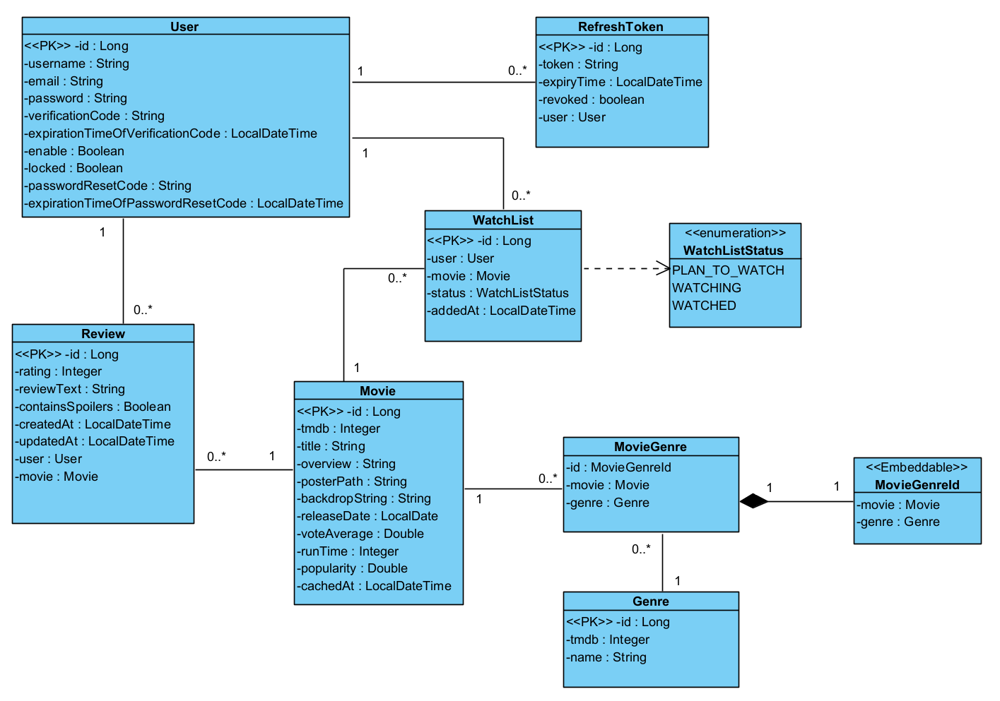

# AtlasWatch

AtlasWatch is a full-stack movie discovery and tracking app built with a Spring Boot backend and a Next.js frontend. Users can browse trending titles, search TMDB-powered results, open movie details, create reviews, and manage a personal watchlist.

The MVP keeps browsing public, while account-only actions such as watchlist updates and review submission require authentication.

## MVP features

- public movie browsing, search, and detail pages
- email-based sign up and account verification
- login, logout, refresh-token session handling
- forgot-password flow with emailed reset codes
- review creation for authenticated users
- watchlist management with `PLAN_TO_WATCH`, `WATCHING`, and `WATCHED`
- PostgreSQL persistence for core app data
- Redis-backed caching for selected movie lookups
- Docker Compose setup for local full-stack runs

## Architecture

AtlasWatch has four main moving parts:

- `moviehub-frontend/`: Next.js 15 frontend for browsing, auth pages, watchlist, and reviews
- `src/main/java/...`: Spring Boot 3 backend with Spring Security, JPA, Redis, and mail integration
- PostgreSQL: primary relational database
- Redis: cache layer for high-read movie flows

### Domain model

Your UML/domain model is included below because it gives the clearest overview of how the backend entities relate to each other.



### Backend relationship summary

- `User` owns `Review`, `RefreshToken`, and `WatchList` records
- `Movie` connects to `Review`, `WatchList`, and `Genre`
- `MovieGenre` models the many-to-many relationship between `Movie` and `Genre`
- `WatchListStatus` captures the viewing lifecycle

## Tech stack

### Frontend

- Next.js 15
- React 19
- TypeScript
- Tailwind CSS 4

### Backend

- Java 21
- Spring Boot 3.4
- Spring Security
- Spring Data JPA
- Spring Data Redis
- Spring Mail
- JWT

### Infrastructure

- PostgreSQL 16
- Redis 8
- Docker Compose

## Repository structure

```text
ai-travel-recommendation/
|-- moviehub-frontend/         # Next.js frontend
|-- src/main/java/             # Spring Boot application code
|-- src/test/java/             # backend unit/web/integration-style tests
|-- docs/                      # architecture, debugging, operations notes
|-- docker-compose.yml         # local full-stack orchestration
|-- Dockerfile                 # backend container build
|-- pom.xml                    # Maven backend config
`-- README.md
```

## Environment configuration

The backend expects a root-level `.env` file in local development. Use `.env.example` as the template.

Important variables include:

- `DB_NAME`
- `SPRING_DATABASE_URL`
- `SPRING_DATABASE_USERNAME`
- `SPRING_DATABASE_PASSWORD`
- `MAIL_HOST`
- `EMAIL`
- `EMAIL_PASSWORD`
- `EXPIRATION_TIME_FOR_REFRESH_TOKEN`
- `CLIENT_ID`
- `CLIENT_SECRET`
- `REDIS_HOST`
- `REDIS_PORT`
- `TMDB_API_TOKEN`
- `PUBLIC_KEY`
- `PRIVATE_KEY`

The frontend can optionally use `moviehub-frontend/.env.example` for local standalone runs:

```env
NEXT_PUBLIC_API_URL=http://localhost:8080
```

## Running the app

### Option 1: Docker Compose

This is the easiest way to run the full MVP locally.

1. Copy `.env.example` to `.env` and fill in real values.
2. From the repository root, run:

```bash
docker compose up --build
```

Services:

- frontend: [http://localhost:3000](http://localhost:3000)
- backend: [http://localhost:8080](http://localhost:8080)
- postgres: `localhost:5432`
- redis: `localhost:6379`

### Option 2: Run backend and frontend separately

#### Prerequisites

- Java 21
- Maven 3.9+ or the Maven wrapper
- Node.js 20+
- npm
- PostgreSQL
- Redis

#### Backend

From the repository root:

```bash
mvn spring-boot:run
```

The backend reads:

```properties
spring.config.import=optional:file:.env[.properties]
```

#### Frontend

```bash
cd moviehub-frontend
npm install
npm run dev
```

The frontend runs on [http://localhost:3000](http://localhost:3000).

## Verification flows

For the current MVP, the important end-to-end flows are:

- browse homepage and search without logging in
- register, receive verification code, and verify account
- log in with username or email
- request a password reset and set a new password
- add a movie to watchlist when authenticated
- submit a review when authenticated
- log out and confirm auth-only actions are blocked again

## Testing

### Backend

Focused auth tests:

```bash
mvn "-Dtest=AuthServiceTest,AuthControllerTest" test
```

Full package check without running the infrastructure-bound smoke test:

```bash
mvn -q -DskipTests package
```

### Frontend

```bash
cd moviehub-frontend
npm run build
```

## API overview

### Auth

- `POST /auth/register`
- `POST /auth/login`
- `POST /auth/verify`
- `POST /auth/resend`
- `POST /auth/password-reset/request`
- `POST /auth/password-reset/confirm`
- `POST /auth/logout`
- `POST /auth/refresh`

### Movies

- `GET /api/movies/trending`
- `GET /api/movies/search`
- `GET /api/movies/{tmdbId}`

### Reviews

- `GET /api/reviews/movie/{tmdbId}`
- `POST /api/reviews`
- `PUT /api/reviews/{reviewId}`
- `DELETE /api/reviews/{reviewId}`

### Watchlist

- `GET /api/watchlist`
- `POST /api/watchlist`
- `PUT /api/watchlist/{id}/status`
- `DELETE /api/watchlist/{id}`

### Operations

- `GET /api/health`

## Supporting docs

- [DTO boundary review](docs/architecture/dto-boundary-review.md)
- [Movie details debugging postmortem](docs/debugging/movie-details-debugging-postmortem.md)
- [Cache behavior](docs/operations/cache-behavior.md)
- [Deployment verification](docs/operations/deployment-verification.md)
- [Search performance notes](docs/performance/search-performance.md)

## MVP status

AtlasWatch is in a strong MVP state: the core browse-search-track-review loop works, authentication is in place, password recovery exists, and Docker can run the stack locally. The remaining work is mostly polish, deployment hardening, and post-MVP improvements rather than missing core functionality.
