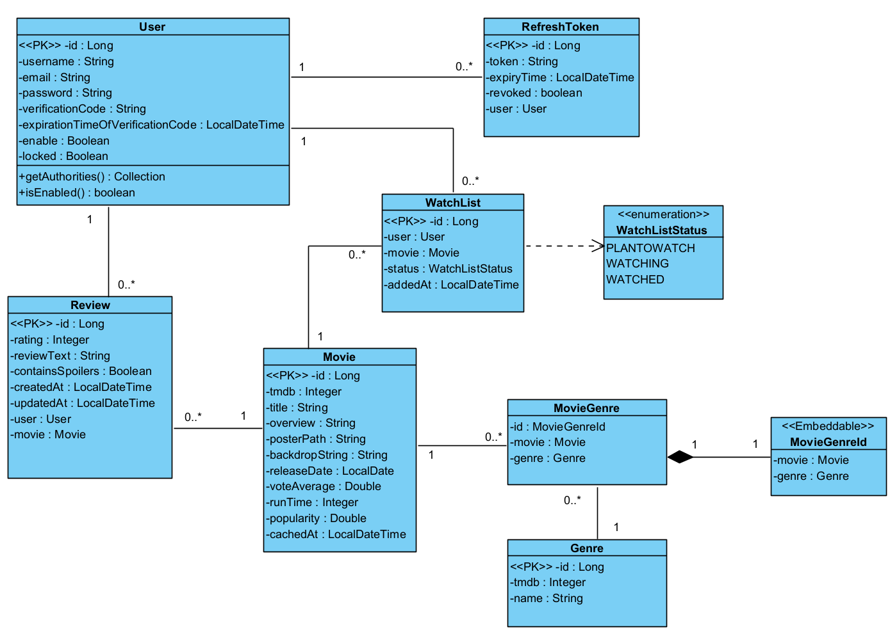

# AtlasWatch

AtlasWatch is a full-stack movie discovery and tracking app built with a Spring Boot backend and a Next.js frontend. Users can browse trending titles, search movies, open detail pages, add reviews, and manage a personal watchlist across statuses like `PLANTOWATCH`, `WATCHING`, and `WATCHED`.

The project started from a broader recommendation-system repo, but the current application is focused on the movie domain and TMDB-powered discovery.

## What the app does

- account registration, email verification, login, logout, and refresh-token based session handling
- trending and search flows powered by TMDB
- movie details with genre metadata and review aggregation
- watchlist management with multiple viewing states
- review creation, update, and deletion
- PostgreSQL persistence for core domain data
- Redis-backed caching for selected high-read flows

## Architecture

At a high level, AtlasWatch uses:

- `moviehub-frontend/`: Next.js 15 + React 19 frontend
- `src/main/java/...`: Spring Boot 3 backend
- PostgreSQL: primary relational store
- Redis: cache layer
- TMDB API: external movie metadata source

The domain model you created is useful in the README because it makes the backend relationships concrete. I included it below as the current architecture/reference diagram.



### Backend domain highlights

- `User` owns many `Review`, `RefreshToken`, and `WatchList` records
- `Movie` is linked to reviews, watchlist entries, and genres
- `MovieGenre` models the many-to-many relationship between `Movie` and `Genre`
- `WatchListStatus` represents the viewing lifecycle

## Tech stack

### Frontend

- Next.js 15
- React 19
- TypeScript
- Tailwind CSS 4

### Backend

- Java 21
- Spring Boot 3.4
- Spring Security
- Spring Data JPA
- Spring Data Redis
- Spring Mail
- JWT

### Infrastructure

- PostgreSQL 16
- Redis 8
- Docker Compose for local data services

## Repository structure

```text
ai-travel-recommendation/
├── moviehub-frontend/         # Next.js frontend
├── src/main/java/             # Spring Boot application code
├── src/test/java/             # backend service/controller/integration tests
├── docs/                      # debugging, architecture, operations notes
├── docker-compose.yml         # local Postgres + Redis
├── pom.xml                    # Maven backend config
└── README.md
```

## Local setup

### Prerequisites

- Java 21
- Maven 3.9+ or the Maven wrapper
- Node.js 20+
- npm
- Docker Desktop

### 1. Start PostgreSQL and Redis

From the repository root:

```bash
docker compose up -d
```

### 2. Configure backend environment variables

The backend reads from a root-level `.env` file through:

```properties
spring.config.import=optional:file:.env[.properties]
```

Create a `.env` file in the repository root with values like:

```env
SPRING_DATABASE_URL=jdbc:postgresql://localhost:5432/your_db_name
SPRING_DATABASE_USERNAME=postgres
SPRING_DATABASE_PASSWORD=postgres
MAIL_HOST=smtp.gmail.com
EMAIL=your-email@example.com
EMAIL_PASSWORD=your-email-password
EXPIRATION_TIME_FOR_REFRESH_TOKEN=86400000
CLIENT_ID=your-google-client-id
CLIENT_SECRET=your-google-client-secret
REDIS_HOST=localhost
REDIS_PORT=6379
TMDB_API_TOKEN=your-tmdb-token
```

### 3. Run the backend

From the repository root:

```bash
mvn spring-boot:run
```

The API is expected on `http://localhost:8080`.

### 4. Configure the frontend

Create `moviehub-frontend/.env.local`:

```env
NEXT_PUBLIC_API_URL=http://localhost:8080
```

### 5. Run the frontend

```bash
cd moviehub-frontend
npm install
npm run dev
```

The frontend runs on `http://localhost:3000` by default.

## Testing and quality checks

### Backend

```bash
mvn test
```

### Frontend

```bash
cd moviehub-frontend
npm run lint
npm exec tsc --noEmit
```

## API surface

### Auth

- `POST /auth/register`
- `POST /auth/login`
- `POST /auth/verify`
- `POST /auth/resend`
- `POST /auth/logout`
- `POST /auth/refresh`

### Movies

- `GET /api/movies/trending`
- `GET /api/movies/search`
- `GET /api/movies/{tmdbId}`
- `GET /api/movies/genres`
- `GET /api/movies/local-search`

### Reviews

- `POST /api/reviews`
- `GET /api/reviews/movie/{tmdbId}`
- `GET /api/reviews/user/{userId}`
- `PUT /api/reviews/{reviewId}`
- `DELETE /api/reviews/{reviewId}`

### Watchlist

- `POST /api/watchlist`
- `GET /api/watchlist`
- `PUT /api/watchlist/{id}/status`
- `DELETE /api/watchlist/{id}`

### Operations

- `GET /api/health`

## Project notes

- Movie discovery data comes from TMDB and is blended with locally stored watchlist/review data.
- Redis is used as a cache layer, but stability and correctness take priority over aggressive caching.
- The frontend now centralizes API calls in `moviehub-frontend/lib/api.ts` so auth and app flows use one consistent client.

## Supporting docs

- [Movie details debugging postmortem](docs/debugging/movie-details-debugging-postmortem.md)
- [Cache behavior](docs/operations/cache-behavior.md)
- [Deployment verification](docs/operations/deployment-verification.md)
- [DTO boundary review](docs/architecture/dto-boundary-review.md)
- [Search performance notes](docs/performance/search-performance.md)

## Current MVP status

AtlasWatch is functional as an MVP candidate, with the core browse-search-track-review loop working locally. The main remaining work is deployment hardening, environment cleanup, database migration strategy, CI/CD, and another UI polish pass.
